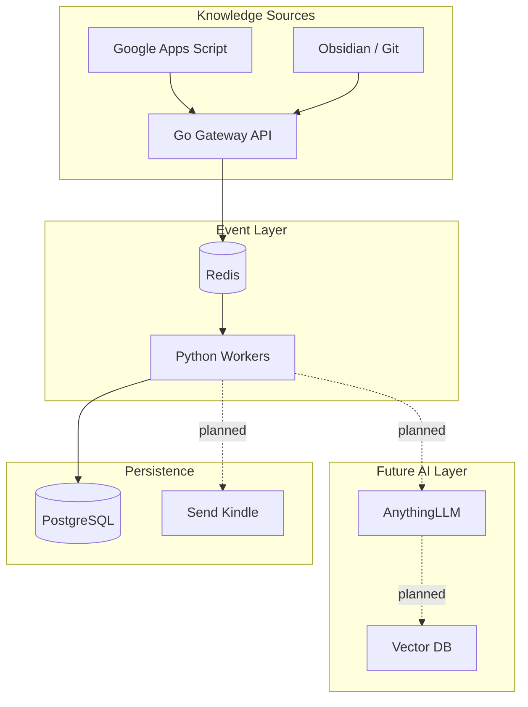

# PKOS – Personal Knowledge Operating System 🥤📚

PKOS is an event-driven personal knowledge infrastructure currently under development.

The project aims to transform static notes from platforms such as **Google Drive** and **Obsidian** into an automated knowledge pipeline powered by asynchronous processing and AI workflows.

Current status:

🚧 Infrastructure Phase + Event Pipeline Foundation

The architecture is already defined, but several intelligence components are still being implemented.

---

# Why “Garapa”? 🥤🌱

The infrastructure layer is inspired by **Garapa**.

In Brazil, *Garapa* is the popular name for **fresh sugarcane juice**, produced by crushing sugarcane stalks and extracting their juice.

This idea inspired PKOS:

Raw notes → Processing → Refined knowledge

The system receives notes and reflections, processes them through queues, AI pipelines and delivery mechanisms, “extracting” learning material from fragmented information.

The Kindle export idea also reinforces this concept:

> PKOS crushes notes and serves learning juice.

---

# Current Architecture 🏗️

PKOS follows a **Modular Monolith + Event-Driven** approach.

Heavy workloads are isolated using queues so AI processing never blocks event ingestion.



---

# Repository Structure 📂

```text
my-pkos/

├── README.md
├── .gitignore
├── .env.example
├── docker-compose.yml
│
├── gateway-go/
│   ├── cmd/api/main.go
│   ├── internal/
│   │   ├── handlers/
│   │   ├── middleware/
│   │   ├── routes/
│   │   ├── services/
│   │   └── models/
│   ├── go.mod
│   └── Dockerfile
│
├── workers-python/
│   ├── app/
│   │   ├── main.py
│   │   ├── tasks/
│   │   ├── ai/
│   │   └── integrations/
│   ├── requirements.txt
│   └── Dockerfile
│
├── infra/
│   ├── traefik/
│   ├── cloudflare/
│   └── postgres/
│
├── apps-script/
│   └── drive-trigger.gs
│
└── scripts/
    ├── dev.sh
    └── test-webhook.sh
```

---

# Components Status 🚧

## Foundation Layer

- [x] Repository organization
- [x] Docker orchestration definition
- [x] Gateway architecture
- [x] Worker separation
- [ ] Redis integration
- [ ] PostgreSQL persistence

---

## Event Ingestion

- [ ] Go Gateway implementation
- [ ] Webhook validation
- [ ] JWT middleware
- [ ] Google Apps Script integration

---

## Processing Layer

- [ ] Redis consumer loop
- [ ] Worker task execution
- [ ] Drive integrations
- [ ] Kindle export

---

## Intelligence Layer (Planned)

- [ ] AnythingLLM integration
- [ ] Embedding ingestion
- [ ] RAG pipeline
- [ ] Vector database

---

# Planned Stack 🚀

| Layer | Technology |
|---|---|
| Gateway | Go + Gin |
| Queue | Redis |
| Workers | Python |
| Storage | PostgreSQL |
| AI | AnythingLLM |
| Reverse Proxy | Traefik |
| Security | Cloudflare Tunnel |
| Delivery | Kindle |

---

# Vision 🎯

PKOS is designed to become a personal knowledge refinery:

Capture → Queue → Process → Enrich → Deliver

Turning notes into continuously consumable knowledge.